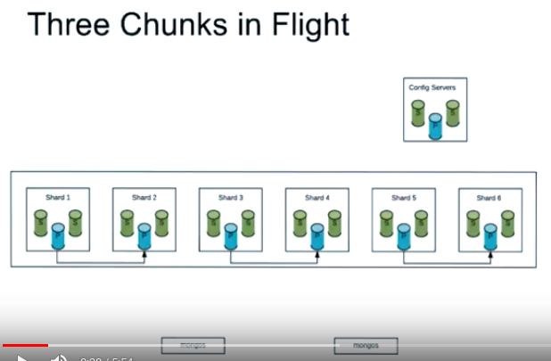

# Sharding Issues

As per MongoDB version 3.4, we can have up to one migration per pair of shards, one sourcing the chunk and one receiving it. An image below illustrate three chunks migration in six shards:



The issue is if chunk grows large enough without being split, it become **jumbo chunk**. The sharded cluster will never move it to another chunk and MongoDB will not try to split it. Remember that default chunk size is 64 MB.


## Diagnose

1. Simulate three sharded clusters:
```mlaunch init --replicaset --sharded 3 --wiredTigerCacheSizeGB 0.3 --oplogSize 10 --port 30000 --host localhost --dir /data/m312```
2. Connect to mongo.
3. Enable sharding:
```sh.enableSharding("m312")```
4. Start sharding with key `{last_name: 1, first_name: 1}`:
```sh.shardCollection("m312.example", {last_name: 1, first_name: 1})```
5. Insert some data to simulate **jumbo chunk**:
```
var oneMBString = Array(1000000).join(' ');
for (i=1; i<=100; i++) {
	db.example.insertOne( { last_name: "Cross", first_name: "Will", filler: oneMBString } )
}
```
6. All data will be populate in only one chunk. This is the **jumbo chunk**.
7. Insert data to simulate that MongoDB will not try to split **jumbo chuck**:
```
for (i=1; i<=100; i++) {
	db.example.insertOne( { last_name: "Leite", first_name: "Norberto", filler: oneMBString } )
}
```
8. See the server logs to detect sharding issue:
```mlogfilter /data/m312/shard01/rs1/mongod.log --component SHARDING | less```
look for for following errors:
```
<TIMESTAP> W SHARDING [connxx] request split points lookup for chunk m312.example { : MinKey, : MinKey } -->> { : MaxKey, : MaxKey }
<TIMESTAP> W SHARDING [connxx] possible low cardinality key detected in m312.example - key is { last_name: "Cross", first_name: "Will" }
```


## Solutions

1. Manually spit the chuck:
```
sh.splitAt( "m312.example", { last_name : "E", first_name: MinKey } )
```
It will create two chunks each of them has 100 MB of size that not perfectly balanced.
2. Try to move chunks manually, but will failed due current average chuck size (100 MB) exceed default maximum chuck size (64 MB):
```
sh.moveChunk("m312.example", { last_name: "Leite", first_name: "Norberto" }, "shard02")
```
will return an error said that "Cannot move chunk: the maximum number of documents for a chuck is 87, the maximum chunk size is 67108864, average document size is 1000079. Found 100 documents in chunk ns: m312.example { last_name: \"E\", first_name: MinKey } -> { last_name: MaxKey, first_name: MaxKey }"
3. Increase the chuck size to 150 MB:
```
use config
db.settings.save( { _id:"chunksize", value: 150 } )
```
4. Try to manually split the chunk again:
```
sh.splitAt( "m312.example", { last_name : "E", first_name: MinKey } )
```
5. Inspect the distribution of chunks:
```
use m312
db.example.getShardDistribution()
```