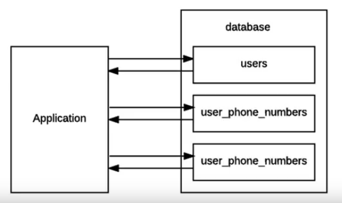

# Schema Investigation

Bad schema design lead performance degradation. We may figure it this situation when our application users grow big.

## Debug

Suppose we have set up development environment which is similar to production environment. We want to figuring out the situation when our application users growth.

1. Start an replica set:
```mlaunch init --replicaset --wiredTigerCacheSizeGB 0.3 --host localhost --port 30000 --oplogSize 100 --name m312RS --dir /data/m312```
2. Generate bad schema data using [generate_bad_schema_data.py](schema/generate_bad_schema_data.py)
```python generate_bad_schema_data.py```
3. Simulate application for bad data schema using [simulate_bad_schema_app.py](schema/simulate_bad_schema_app.py)
```python simulate_bad_schema_app.py```
4. Start new session and log into `mongo`:
```mongo --port 30000 m312``
5. Enable the **profiler**:
```db.setProfilerLevel(2)```
6. Back to *app* session and hit `Enter` to start the simulation.
7. Back to `mongo` and turn off the profiler:
```db.setProfilingLevel(0)```
8. Get profiler data length:
```db.system.profile.count()```

## Diagnose

* Get `planSummary` of profiler:
```db.system.profile.find({}, {planSummary: 1})```
* Get detailed profiler data:
```db.system.profile.find({}, {planSummary: 1, op: 1, query: 1, ns: 1}).pretty()```
* For simplicity, lets do aggregation on profiler data:
```db.system.profile.aggregate([{$group: {_id: {op: "$op", ns: "$ns"}}}])```

After inspecting the profiler data, it is look like the database designer just migrate the schema from relational schema design which is not recommended. Remember that MongoDB is schemaless database. The bad schema looks like this:



Notice that this schema is in normalized form of relational schema. This is main reason why we see many queries in profiler. The bad things that happen using this schema are loop through all `user` collection to find specific username and loop through all `user_phone_numbers` collection to find matched phone number by given username.

## Solutions

1. Do fully migration from relational schema to schemaless model. For example, just group all user's data such as address and phone number into single collection.
2. Think about efficient application design to optimize schemaless model. For example, we may decide to create `purchase_history` and `shipping_address_history` in separate collection and show them in another page.